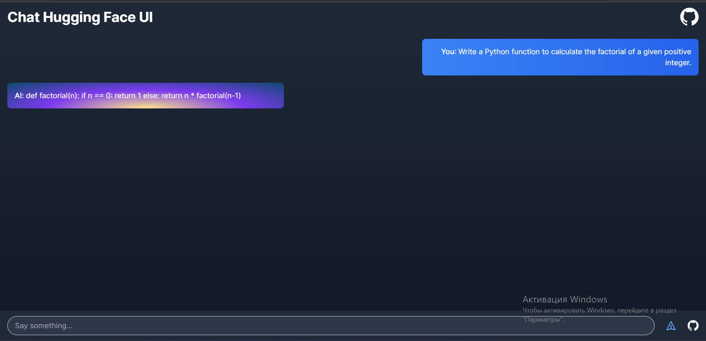
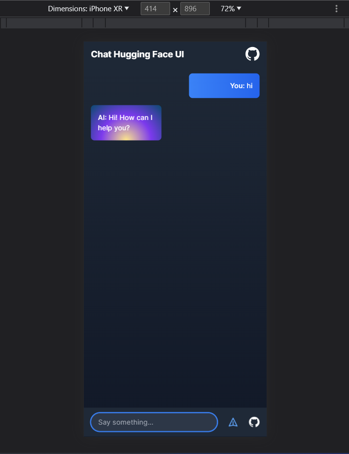

  <h1>🚀Hugging Face Chatbot🤖</h1>

  

    
    
    
   

  
  
  
This project is a template for building a chatbot using TypeScript and Next.js, powered by the Hugging Face API. With this template, you can quickly set up a chatbot that uses the Open Assistant SFT-4 12B model to answer various questions and engage in conversations on different topics.

  

  

 

  

<div align="center"
## Deploy your own

Deploy the example using [Vercel](https://vercel.com?utm_source=github&utm_medium=readme&utm_campaign=ai-sdk-example):

## Example Chatbot using Hugging Face and Next.js

Welcome to a simple chatbot application using Hugging Face and Next.js. This application provides a basic user interface for users to interact with the Open Assistant SFT-4 12B model. With just a few clicks you can chat with a fine-tuned English language model designed for conversation.

Here are some key features of the application:
- 🤖 Easy-to-use chat interface
- 🚀 Quick and responsive
- 🤪 Fun to chat with!

## About Hugging Face

[Hugging Face](https://huggingface.co) is a company that develops tools for building applications using machine learning. It is most notable for its 🤖 [Transformers](https://huggingface.co/docs/transformers/index) Python library built for natural language processing applications and its platform that allows users to share machine learning models and datasets.

## About Open Assistant

The model in the example is [Open Assistant SFT-4 12B](https://huggingface.co/OpenAssistant/oasst-sft-4-pythia-12b-epoch-3.5). This is the 4th iteration English supervised-fine-tuning (SFT) model of the Open-Assistant project. It is based on a Pythia 12B that was fine-tuned on human demonstrations of assistant conversations collected through the [Open Assistant](https://open-assistant.io/) human feedback web app before March 25, 2023. 

## Deploy your own
To run the example locally you need to:

1. Sign up at [Hugging Face](https://huggingface.co/join).
2. Go to your [Hugging Face account settings](https://huggingface.co/settings/tokens). Create a User Access Token with `write` access.
3. Set the required Hugging Face environment variable with the token as shown [the example env file](./.env.local.example) but in a new file called `.env.local`.
4. Clone the repository, `git clone https://github.com/ElonMusk2002/chat-huggingface.git`
5. Install the required dependencies with `npm install`
6. Launch the development server with `npm dev`

## 🛠️ Built With

### Tech Stack

### Tools Used

## 🤝 Contributing

If you want to contribute to this project, feel free to open a [pull request](https://github.com/ElonMusk2002/chat-huggingface/pulls) or an [issue](https://github.com/ElonMusk2002/chat-huggingface/issues) on GitHub. Before submitting any changes, please make sure you follow these guidelines:

- Check if someone else has already reported the same issue or suggested the same improvement.
- Create a new branch for your changes and use descriptive branch names.
- Write clear commit messages and add comments to your code.
- Make sure your changes are properly tested.
- Update the documentation if necessary.

Thank you for your contributions! 
